<div align="center">

<!-- Animated multi-line typing title -->


<br/>

<!-- Enhanced animated SVG — glowing cap with pulse rings + orbiting dots -->
<svg xmlns="http://www.w3.org/2000/svg" width="200" height="200" viewBox="0 0 200 200">
  <defs>
    <radialGradient id="pulseGlow" cx="50%" cy="50%" r="50%">
      <stop offset="0%" stop-color="#4FC3F7" stop-opacity="0.22"/>
      <stop offset="70%" stop-color="#7C4DFF" stop-opacity="0.06"/>
      <stop offset="100%" stop-color="#000" stop-opacity="0"/>
    </radialGradient>
    <radialGradient id="coreGlow" cx="50%" cy="50%" r="50%">
      <stop offset="0%" stop-color="#4FC3F7" stop-opacity="0.35"/>
      <stop offset="100%" stop-color="#4FC3F7" stop-opacity="0"/>
    </radialGradient>
  </defs>

  <!-- Soft background glow -->
  <circle cx="100" cy="100" r="90" fill="url(#pulseGlow)">
    <animate attributeName="r" values="80;92;80" dur="4s" repeatCount="indefinite"/>
    <animate attributeName="opacity" values="0.6;1;0.6" dur="4s" repeatCount="indefinite"/>
  </circle>

  <!-- Static reference rings -->
  <circle cx="100" cy="100" r="88" fill="none" stroke="#4FC3F7" stroke-width="0.5" stroke-opacity="0.12"/>
  <circle cx="100" cy="100" r="70" fill="none" stroke="#4FC3F7" stroke-width="0.5" stroke-opacity="0.12"/>
  <circle cx="100" cy="100" r="50" fill="none" stroke="#7C4DFF" stroke-width="0.5" stroke-opacity="0.12"/>

  <!-- Crosshair guides -->
  <line x1="100" y1="12" x2="100" y2="188" stroke="#4FC3F7" stroke-width="0.4" stroke-opacity="0.15"/>
  <line x1="12" y1="100" x2="188" y2="100" stroke="#4FC3F7" stroke-width="0.4" stroke-opacity="0.15"/>

  <!-- Outer spinning dashed ring -->
  <circle cx="100" cy="100" r="88" fill="none" stroke="#4FC3F7" stroke-width="1.4"
    stroke-dasharray="18 9" stroke-linecap="round" stroke-opacity="0.65">
    <animateTransform attributeName="transform" type="rotate"
      from="0 100 100" to="360 100 100" dur="10s" repeatCount="indefinite"/>
  </circle>

  <!-- Middle counter-rotating dashed ring -->
  <circle cx="100" cy="100" r="72" fill="none" stroke="#7C4DFF" stroke-width="0.9"
    stroke-dasharray="7 6" stroke-opacity="0.5">
    <animateTransform attributeName="transform" type="rotate"
      from="360 100 100" to="0 100 100" dur="7s" repeatCount="indefinite"/>
  </circle>

  <!-- Inner pulse ring -->
  <circle cx="100" cy="100" r="50" fill="none" stroke="#00e676" stroke-width="0.7"
    stroke-dasharray="4 8" stroke-opacity="0.4">
    <animateTransform attributeName="transform" type="rotate"
      from="0 100 100" to="360 100 100" dur="4s" repeatCount="indefinite"/>
    <animate attributeName="stroke-opacity" values="0.2;0.6;0.2" dur="3s" repeatCount="indefinite"/>
  </circle>

  <!-- Orbiting dot 1 (cyan, outer ring) -->
  <circle r="4" fill="#4FC3F7" opacity="0.9">
    <animateMotion dur="10s" repeatCount="indefinite">
      <mpath href="#orbit1"/>
    </animateMotion>
    <animate attributeName="opacity" values="0.6;1;0.6" dur="2s" repeatCount="indefinite"/>
  </circle>
  <path id="orbit1" d="M 100,12 A 88,88 0 1 1 99.9,12" fill="none"/>

  <!-- Orbiting dot 2 (purple, middle ring, opposite phase) -->
  <circle r="3" fill="#7C4DFF" opacity="0.8">
    <animateMotion dur="7s" repeatCount="indefinite" keyPoints="0.5;1;0.5" keyTimes="0;0.5;1" calcMode="linear">
      <mpath href="#orbit2"/>
    </animateMotion>
  </circle>
  <path id="orbit2" d="M 100,28 A 72,72 0 1 1 99.9,28" fill="none"/>

  <!-- Orbiting dot 3 (green, inner ring) -->
  <circle r="2.5" fill="#00e676" opacity="0.7">
    <animateMotion dur="4s" repeatCount="indefinite" keyPoints="0.25;1;0.25" keyTimes="0;0.5;1" calcMode="linear">
      <mpath href="#orbit3"/>
    </animateMotion>
  </circle>
  <path id="orbit3" d="M 100,50 A 50,50 0 1 1 99.9,50" fill="none"/>

  <!-- Graduation cap brim -->
  <rect x="78" y="99" width="44" height="7" rx="2.5"
    fill="rgba(79,195,247,0.14)" stroke="#4FC3F7" stroke-width="1.3">
    <animate attributeName="stroke-opacity" values="0.4;1;0.4" dur="2.2s" repeatCount="indefinite"/>
  </rect>

  <!-- Graduation cap top diamond -->
  <polygon points="100,76 124,93 100,99 76,93"
    fill="rgba(79,195,247,0.12)" stroke="#4FC3F7" stroke-width="1.3">
    <animate attributeName="stroke-opacity" values="0.4;1;0.4" dur="2.2s" repeatCount="indefinite"/>
    <animate attributeName="fill-opacity" values="0.08;0.2;0.08" dur="2.2s" repeatCount="indefinite"/>
  </polygon>

  <!-- Tassel string -->
  <line x1="124" y1="93" x2="124" y2="114" stroke="#4FC3F7" stroke-width="1" stroke-opacity="0.7"/>
  <!-- Tassel ball -->
  <circle cx="124" cy="116" r="3" fill="none" stroke="#4FC3F7" stroke-width="1.2">
    <animate attributeName="opacity" values="0.3;1;0.3" dur="1.6s" repeatCount="indefinite"/>
  </circle>

  <!-- Core centre glow -->
  <circle cx="100" cy="100" r="16" fill="url(#coreGlow)">
    <animate attributeName="r" values="14;18;14" dur="2.5s" repeatCount="indefinite"/>
    <animate attributeName="opacity" values="0.5;1;0.5" dur="2.5s" repeatCount="indefinite"/>
  </circle>

  <!-- Corner blinking status dots -->
  <circle cx="28" cy="38" r="2.5" fill="#4FC3F7">
    <animate attributeName="opacity" values="0;1;0" dur="2.2s" begin="0.1s" repeatCount="indefinite"/>
  </circle>
  <circle cx="172" cy="140" r="2.5" fill="#7C4DFF">
    <animate attributeName="opacity" values="0;1;0" dur="2.7s" begin="0.7s" repeatCount="indefinite"/>
  </circle>
  <circle cx="164" cy="34" r="2" fill="#00e676">
    <animate attributeName="opacity" values="0;1;0" dur="2s" begin="1.2s" repeatCount="indefinite"/>
  </circle>
  <circle cx="34" cy="152" r="2" fill="#ff6d00">
    <animate attributeName="opacity" values="0;1;0" dur="2.4s" begin="0.4s" repeatCount="indefinite"/>
  </circle>
  <circle cx="100" cy="16" r="1.8" fill="#4FC3F7" opacity="0.5">
    <animate attributeName="opacity" values="0.2;0.9;0.2" dur="1.8s" begin="0.9s" repeatCount="indefinite"/>
  </circle>
</svg>

<br/>

<!-- Badge row 1: Core stack -->


<br/>

<!-- Badge row 2: Tools & status -->


<br/>

<!-- Animated role-feature highlight strip -->
<svg xmlns="http://www.w3.org/2000/svg" width="680" height="54" viewBox="0 0 680 54">
  <defs>
    <linearGradient id="hStrip" x1="0" y1="0" x2="1" y2="0">
      <stop offset="0%"   stop-color="#4FC3F7" stop-opacity="0"/>
      <stop offset="15%"  stop-color="#4FC3F7" stop-opacity="0.5"/>
      <stop offset="50%"  stop-color="#7C4DFF" stop-opacity="0.5"/>
      <stop offset="85%"  stop-color="#00e676" stop-opacity="0.5"/>
      <stop offset="100%" stop-color="#00e676" stop-opacity="0"/>
    </linearGradient>
    <linearGradient id="scan" x1="0" y1="0" x2="1" y2="0">
      <stop offset="0%"   stop-color="#fff" stop-opacity="0"/>
      <stop offset="50%"  stop-color="#fff" stop-opacity="0.12"/>
      <stop offset="100%" stop-color="#fff" stop-opacity="0"/>
    </linearGradient>
  </defs>
  <!-- Background strip -->
  <rect x="0" y="18" width="680" height="18" rx="9" fill="rgba(255,255,255,0.04)" stroke="none"/>
  <!-- Gradient fill -->
  <rect x="0" y="18" width="680" height="18" rx="9" fill="url(#hStrip)" opacity="0.7"/>
  <!-- Scan line animation -->
  <rect x="-160" y="18" width="160" height="18" rx="9" fill="url(#scan)">
    <animateTransform attributeName="transform" type="translate"
      from="-160 0" to="840 0" dur="3s" repeatCount="indefinite"/>
  </rect>
  <!-- Role labels -->
  <text x="113" y="31" font-family="'Courier New',monospace" font-size="9.5" fill="#4FC3F7"
    text-anchor="middle" letter-spacing="2" font-weight="bold">🏛 HOD / ADMIN</text>
  <text x="340" y="31" font-family="'Courier New',monospace" font-size="9.5" fill="#c4b5fd"
    text-anchor="middle" letter-spacing="2" font-weight="bold">👨‍🏫 STAFF</text>
  <text x="567" y="31" font-family="'Courier New',monospace" font-size="9.5" fill="#00e676"
    text-anchor="middle" letter-spacing="2" font-weight="bold">🎓 STUDENT</text>
  <!-- Divider ticks -->
  <line x1="226" y1="14" x2="226" y2="40" stroke="#fff" stroke-width="0.7" stroke-opacity="0.25"/>
  <line x1="453" y1="14" x2="453" y2="40" stroke="#fff" stroke-width="0.7" stroke-opacity="0.25"/>
  <!-- Top & bottom accent lines -->
  <rect x="0" y="17" width="680" height="1" fill="url(#hStrip)" opacity="0.5"/>
  <rect x="0" y="36" width="680" height="1" fill="url(#hStrip)" opacity="0.5"/>
</svg>

<br/>

> **A Simple Student Management System Developed While Learning Django — College Major Project 2026**

<br/>

🎬 [**Watch Demo on YouTube**](https://www.youtube.com/watch?v=kArCR96m7uo "Django Student Management System Demo") &nbsp;|&nbsp; 🎨 [**Front-end Template (AdminLTE)**](http://adminlte.io "Admin LTE.io") &nbsp;|&nbsp; 🌐 [**Live Demo**](https://smswithdjango.herokuapp.com/)

<br/>

<!-- GitHub repo stats -->
[](https://github.com/ChiranjibSaiChandanNath/CMS/stargazers)
[](https://github.com/ChiranjibSaiChandanNath/CMS/network/members)
[](https://github.com/ChiranjibSaiChandanNath/CMS/issues)
[](https://github.com/ChiranjibSaiChandanNath/CMS/commits)

<br/>

> If you find this project useful, please consider giving it a **⭐ Star** — it really helps! 👆

</div>

<!-- Animated wave divider -->
<div align="center">
<svg xmlns="http://www.w3.org/2000/svg" width="900" height="60" viewBox="0 0 900 60" preserveAspectRatio="none">
  <defs>
    <linearGradient id="waveGrad" x1="0" y1="0" x2="1" y2="0">
      <stop offset="0%"   stop-color="#4FC3F7" stop-opacity="0"/>
      <stop offset="20%"  stop-color="#4FC3F7" stop-opacity="0.6"/>
      <stop offset="50%"  stop-color="#7C4DFF" stop-opacity="0.6"/>
      <stop offset="80%"  stop-color="#00e676" stop-opacity="0.6"/>
      <stop offset="100%" stop-color="#00e676" stop-opacity="0"/>
    </linearGradient>
  </defs>
  <path d="M0,30 C150,55 300,5 450,30 C600,55 750,5 900,30" fill="none" stroke="url(#waveGrad)" stroke-width="2">
    <animate attributeName="d"
      values="M0,30 C150,55 300,5 450,30 C600,55 750,5 900,30;
              M0,30 C150,5 300,55 450,30 C600,5 750,55 900,30;
              M0,30 C150,55 300,5 450,30 C600,55 750,5 900,30"
      dur="5s" repeatCount="indefinite"/>
  </path>
  <path d="M0,38 C150,62 300,14 450,38 C600,62 750,14 900,38" fill="none" stroke="url(#waveGrad)" stroke-width="1" opacity="0.4">
    <animate attributeName="d"
      values="M0,38 C150,62 300,14 450,38 C600,62 750,14 900,38;
              M0,38 C150,14 300,62 450,38 C600,14 750,62 900,38;
              M0,38 C150,62 300,14 450,38 C600,62 750,14 900,38"
      dur="5s" begin="0.8s" repeatCount="indefinite"/>
  </path>
</svg>
</div>

---

## 📁 Project Structure

```
student-management-using-django/
├── manage.py                        ← Django CLI entry point
├── requirements.txt                 ← Python dependencies
├── Procfile                         ← Deployment config (Gunicorn)
├── .env                             ← Secret keys (never commit this)
├── .env.example                     ← Template for environment variables
├── db.sqlite3                       ← SQLite database (auto-created on migrate)
├── student_management_system/
│   ├── settings.py                  ← Core Django configuration
│   ├── urls.py                      ← Root URL dispatcher
│   ├── wsgi.py / asgi.py            ← WSGI / ASGI entry points
├── main_app/
│   ├── models.py                    ← Database models (User, Student, Staff…)
│   ├── views.py                     ← Auth, login, shared views
│   ├── hod_views.py                 ← Admin / HOD panel logic
│   ├── staff_views.py               ← Staff panel logic
│   ├── student_views.py             ← Student panel logic
│   ├── EditResultView.py            ← Class-based result editing view
│   ├── EmailBackend.py              ← Custom email authentication backend
│   ├── middleware.py                ← Login-check middleware
│   ├── forms.py                     ← Django ModelForms
│   ├── urls.py                      ← App-level URL patterns
│   ├── templates/                   ← HTML templates per role
│   └── static/                      ← CSS, JS, images
├── media/                           ← Uploaded profile pictures
└── ss/                              ← Screenshots gallery
```

---

## ✨ Features

### 🏛️ A. Admin / HOD Can

1. See overall summary charts of Students Performances, Staff Performances, Courses, Subjects, Leave, etc.
2. Manage Staff (Add, Update and Delete)
3. Manage Students (Add, Update and Delete)
4. Manage Course (Add, Update and Delete)
5. Manage Subjects (Add, Update and Delete)
6. Manage Sessions (Add, Update and Delete)
7. View Student Attendance
8. Review and Reply to Student / Staff Feedback
9. Review (Approve / Reject) Student / Staff Leave

### 👨‍🏫 B. Staff / Teachers Can

1. See overall summary charts related to their students, subjects, leave status, etc.
2. Take / Update Students Attendance
3. Add / Update Student Results
4. Apply for Leave
5. Send Feedback to HOD

### 🎓 C. Students Can

1. See overall summary charts related to their attendance, subjects, leave status, etc.
2. View Attendance
3. View Result
4. Apply for Leave
5. Send Feedback to HOD

---

<!-- Stats counter strip -->
<div align="center">
<svg xmlns="http://www.w3.org/2000/svg" width="700" height="80" viewBox="0 0 700 80">
  <defs>
    <linearGradient id="cardG1" x1="0" y1="0" x2="0" y2="1">
      <stop offset="0%" stop-color="#4FC3F7" stop-opacity="0.18"/>
      <stop offset="100%" stop-color="#4FC3F7" stop-opacity="0.04"/>
    </linearGradient>
    <linearGradient id="cardG2" x1="0" y1="0" x2="0" y2="1">
      <stop offset="0%" stop-color="#7C4DFF" stop-opacity="0.18"/>
      <stop offset="100%" stop-color="#7C4DFF" stop-opacity="0.04"/>
    </linearGradient>
    <linearGradient id="cardG3" x1="0" y1="0" x2="0" y2="1">
      <stop offset="0%" stop-color="#00e676" stop-opacity="0.18"/>
      <stop offset="100%" stop-color="#00e676" stop-opacity="0.04"/>
    </linearGradient>
    <linearGradient id="cardG4" x1="0" y1="0" x2="0" y2="1">
      <stop offset="0%" stop-color="#ff6d00" stop-opacity="0.18"/>
      <stop offset="100%" stop-color="#ff6d00" stop-opacity="0.04"/>
    </linearGradient>
  </defs>
  <!-- Card 1: User Roles -->
  <rect x="10"  y="8" width="155" height="62" rx="10" fill="url(#cardG1)" stroke="#4FC3F7" stroke-width="0.8" stroke-opacity="0.5"/>
  <text x="87"  y="34" font-family="Orbitron,monospace" font-size="22" fill="#4FC3F7" text-anchor="middle" font-weight="bold">3</text>
  <text x="87"  y="54" font-family="monospace" font-size="9"  fill="#4FC3F7" text-anchor="middle" opacity="0.8" letter-spacing="1">USER ROLES</text>
  <!-- Card 2: Admin Features -->
  <rect x="185" y="8" width="155" height="62" rx="10" fill="url(#cardG2)" stroke="#7C4DFF" stroke-width="0.8" stroke-opacity="0.5"/>
  <text x="262" y="34" font-family="Orbitron,monospace" font-size="22" fill="#c4b5fd" text-anchor="middle" font-weight="bold">9+</text>
  <text x="262" y="54" font-family="monospace" font-size="9"  fill="#c4b5fd" text-anchor="middle" opacity="0.8" letter-spacing="1">ADMIN FEATURES</text>
  <!-- Card 3: Models -->
  <rect x="360" y="8" width="155" height="62" rx="10" fill="url(#cardG3)" stroke="#00e676" stroke-width="0.8" stroke-opacity="0.5"/>
  <text x="437" y="34" font-family="Orbitron,monospace" font-size="22" fill="#00e676" text-anchor="middle" font-weight="bold">12</text>
  <text x="437" y="54" font-family="monospace" font-size="9"  fill="#00e676" text-anchor="middle" opacity="0.8" letter-spacing="1">DB MODELS</text>
  <!-- Card 4: Milestones -->
  <rect x="535" y="8" width="155" height="62" rx="10" fill="url(#cardG4)" stroke="#ff6d00" stroke-width="0.8" stroke-opacity="0.5"/>
  <text x="612" y="34" font-family="Orbitron,monospace" font-size="22" fill="#ff6d00" text-anchor="middle" font-weight="bold">35</text>
  <text x="612" y="54" font-family="monospace" font-size="9"  fill="#ff6d00" text-anchor="middle" opacity="0.8" letter-spacing="1">MILESTONES ✓</text>
  <!-- Animated glint on card 1 -->
  <rect x="10" y="8" width="40" height="62" rx="10" fill="white" opacity="0">
    <animate attributeName="opacity" values="0;0.06;0" dur="4s" begin="0s" repeatCount="indefinite"/>
    <animateTransform attributeName="transform" type="translate" from="0 0" to="115 0" dur="4s" begin="0s" repeatCount="indefinite"/>
  </rect>
</svg>
</div>

## 👥 User Role Flow

```
                    ┌──────────────────────────────────┐
                    │           LOGIN PAGE              │
                    └──────────────┬───────────────────┘
                                   │
           ┌───────────────────────┼───────────────────────┐
           ▼                       ▼                       ▼
    ┌─────────────┐       ┌─────────────────┐     ┌──────────────┐
    │  HOD / Admin│       │     Staff        │     │   Student    │
    └──────┬──────┘       └────────┬────────┘     └──────┬───────┘
           │                       │                      │
    Manage everything       Mark attendance         View attendance
    Add/edit users          Grade students          View results
    View all reports        Apply for leave         Apply for leave
    Send notifications      Submit feedback         Submit feedback
    Manage courses          View notifications      View notifications
    Manage sessions         View/edit profile       View/edit profile
```

---

## 🗄️ Data Model Overview

```
CustomUser (AbstractUser — email-based auth)
 ├── Admin       ← user_type = 1 (HOD)
 ├── Staff       ← user_type = 2
 └── Student     ← user_type = 3

Course ──────────────────┐
Session ─────────────────┼── Student
Subject (Staff + Course) ┘

Attendance (Subject + Session + Date)
 └── AttendanceReport (Student + Status)

LeaveReportStudent / LeaveReportStaff
FeedbackStudent / FeedbackStaff
NotificationStudent / NotificationStaff
StudentResult (Student + Subject + Test + Exam)
```

---

## 🔄 How It Works

```
1.  User visits http://127.0.0.1:8000
2.  Login page authenticates via email + password (custom EmailBackend)
3.  LoginCheckMiddleware routes the user to their role-specific dashboard
4.  HOD can create courses, sessions, staff, and students
5.  Staff marks attendance per subject/session using an AJAX form
6.  Staff enters test & exam results for each student per subject
7.  Students view their own attendance & result records
8.  HOD approves/rejects leave requests from staff & students
9.  Feedback messages are exchanged between users and HOD
10. Firebase FCM delivers real-time push notifications to browsers
```

---

## 📸 Screenshots

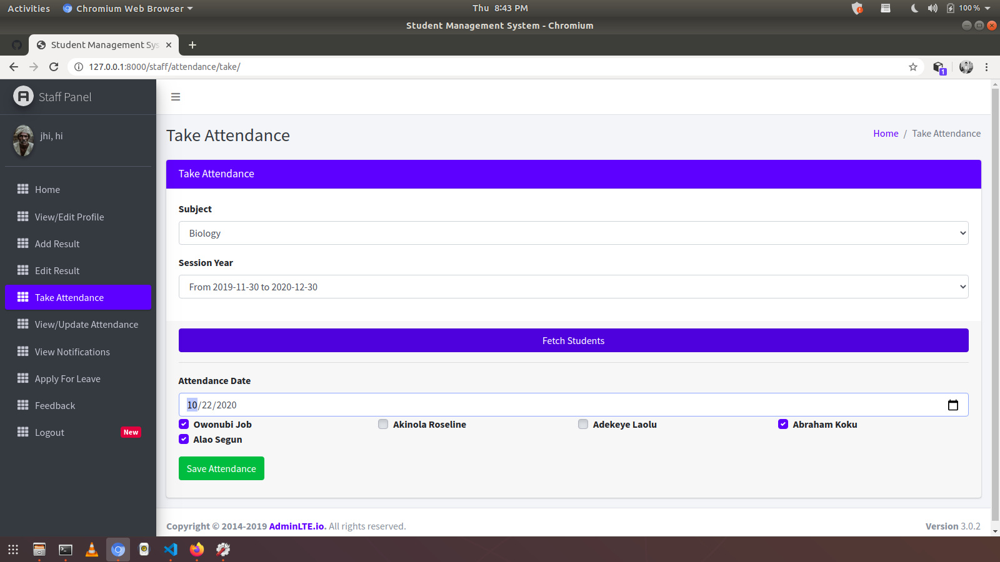
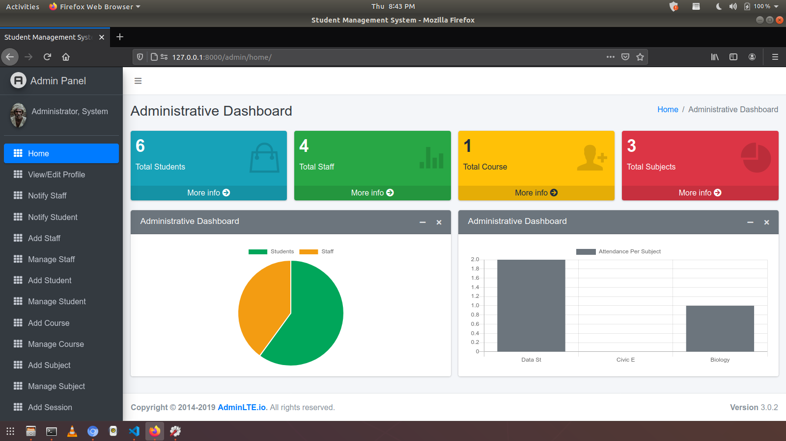
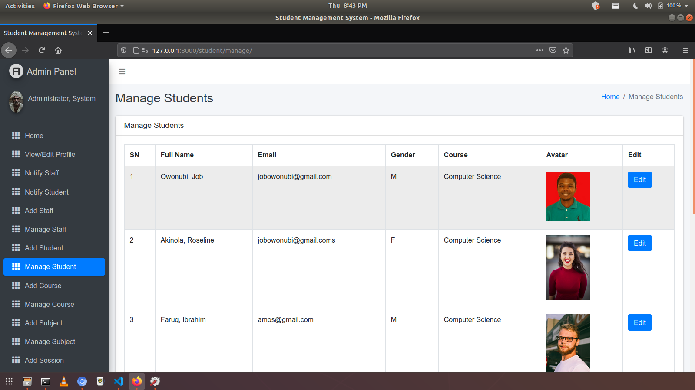
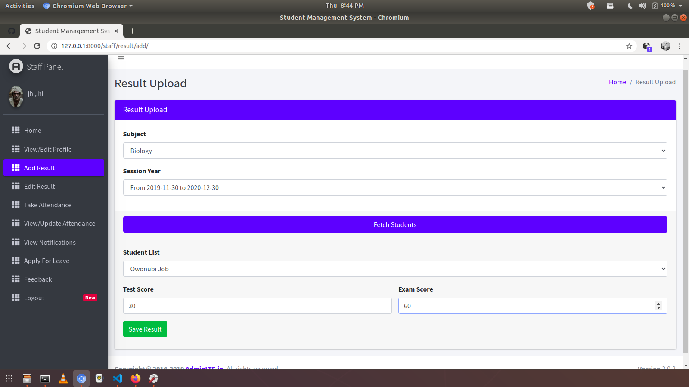
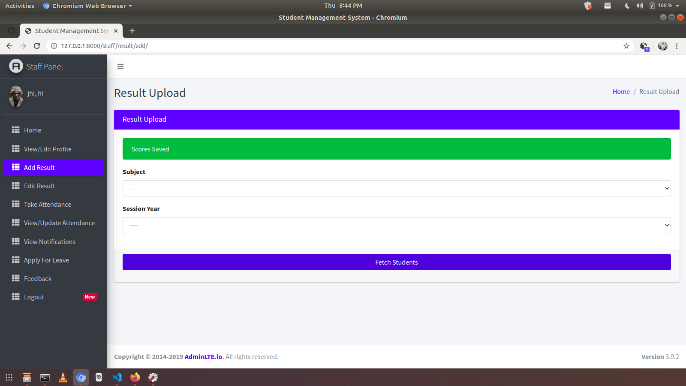

| Admin | Staff | Student |
|:-----:|:-----:|:-------:|
|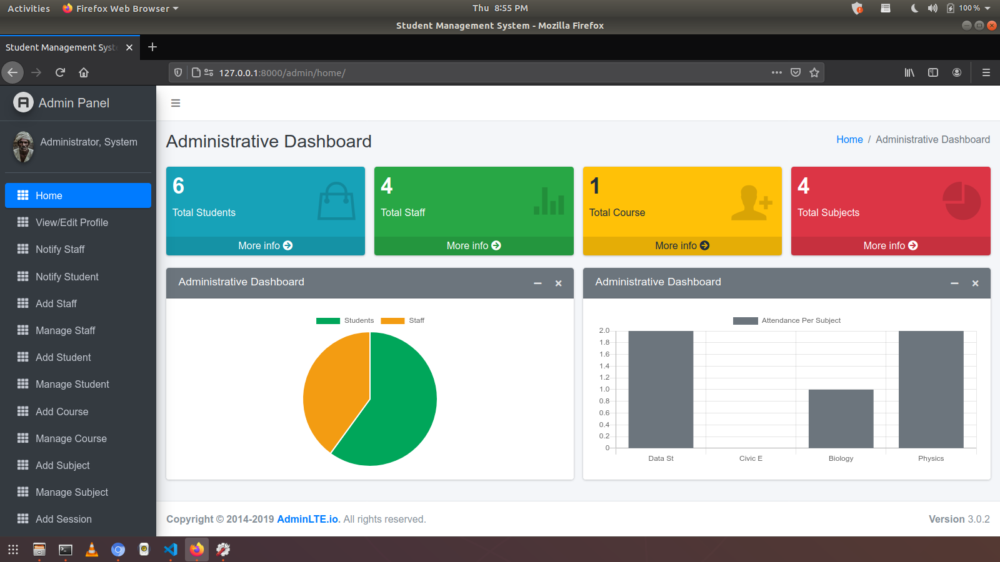|||
||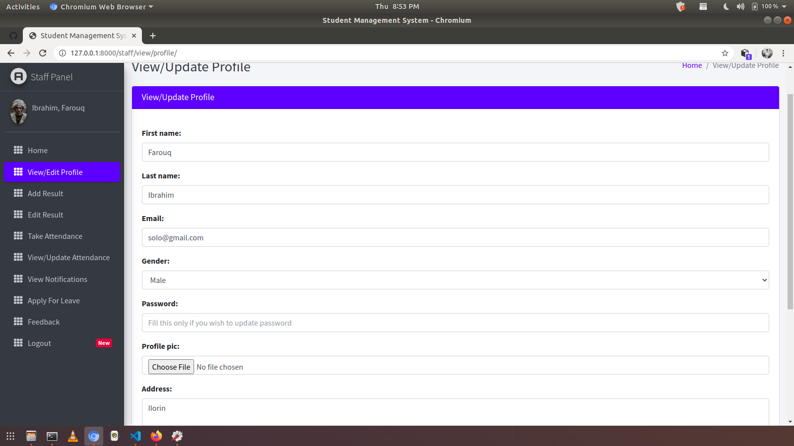||
||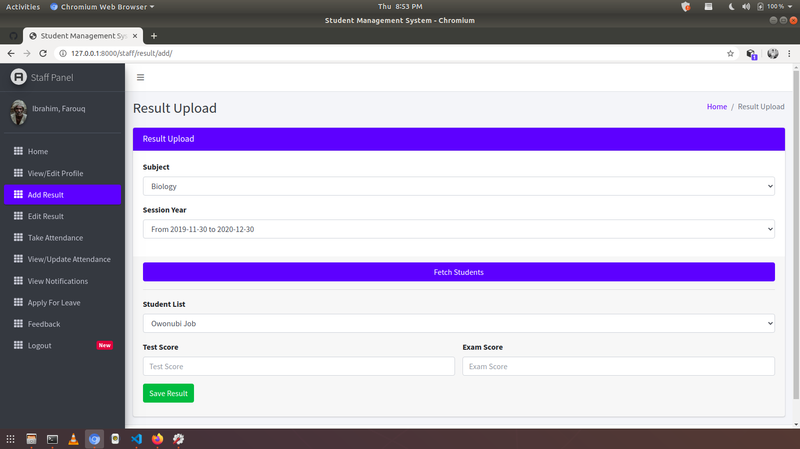|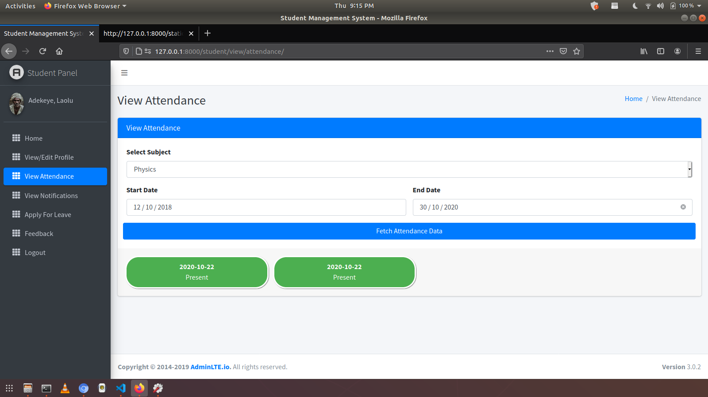|
||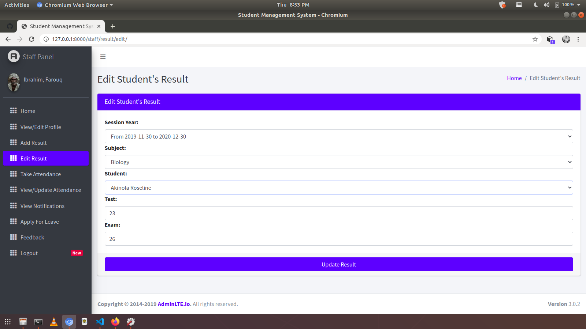||
|||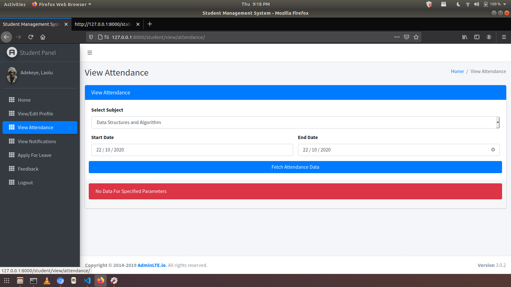|
|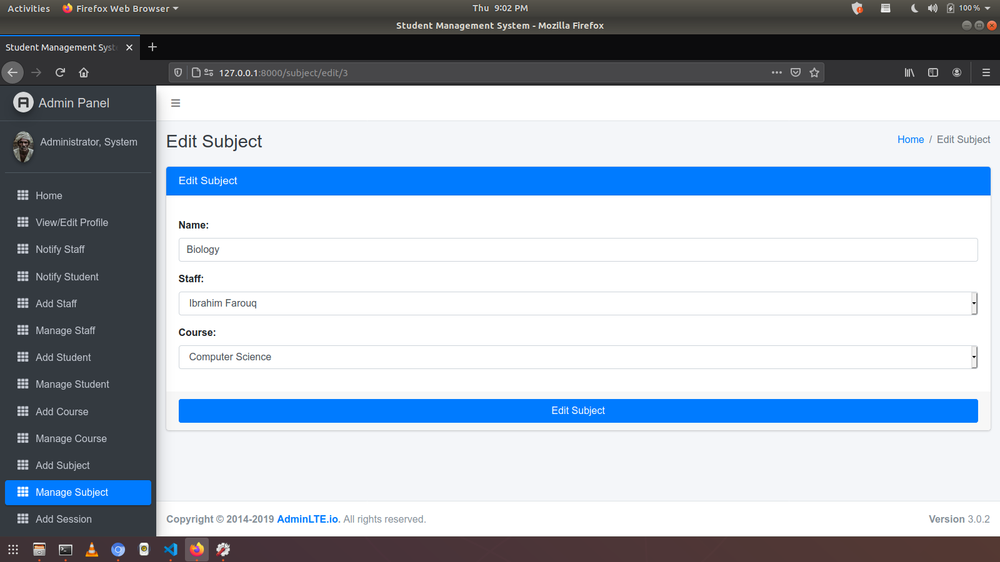|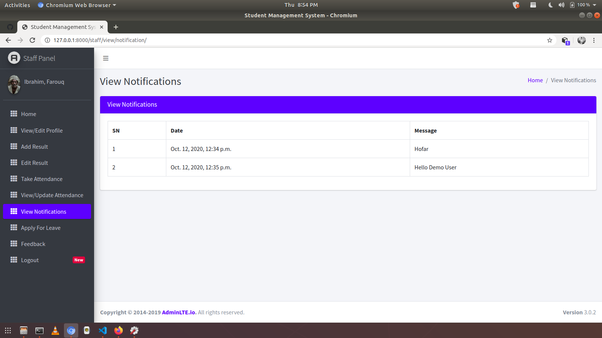||

---

## 🚀 How to Install and Run

### Pre-Requisites

| Tool | Download |
|------|----------|
| Git | [git-scm.com](https://git-scm.com/) |
| Python (latest) | [python.org/downloads](https://www.python.org/downloads/) |
| pip | [pip.pypa.io](https://pip.pypa.io/en/stable/installing/) |

---

### Step 1 · Create a Virtual Environment

Install virtualenv:
```bash
pip install virtualenv
```

Create the environment:

```bash
# Windows
python -m venv venv

# Mac
python3 -m venv venv

# Linux
virtualenv .
```

Activate the environment:

```bash
# Windows
source venv/scripts/activate

# Mac
source venv/bin/activate

# Linux
source bin/activate
```

---

### Step 2 · Clone the Repository

```bash
git clone https://github.com/ChiranjibSaiChandanNath/CMS.git
cd CMS
```

---

### Step 3 · Install Dependencies

```bash
pip3 install -r requirements.txt
```

---

### Step 4 · Configure Environment Variables

```bash
cp .env.example .env
# Then open .env and fill in your secret values
```

| Variable | Description | Where to get |
|----------|-------------|--------------|
| `DJANGO_SECRET_KEY` | Django secret key | [djecrety.ir](https://djecrety.ir/) |
| `RECAPTCHA_SECRET_KEY` | Google reCAPTCHA | [recaptcha admin](https://www.google.com/recaptcha/admin) |
| `FIREBASE_SERVER_KEY` | FCM push notifications | Firebase Console › Cloud Messaging |
| `EMAIL_ADDRESS` | Gmail address for SMTP | Your Gmail |
| `EMAIL_PASSWORD` | Gmail App Password | Google Account › Security |

> ⚠️ **Never commit your `.env` file** — it is already in `.gitignore`.

---

### Step 5 · Configure Allowed Hosts

In `student_management_system/settings.py`, set:
```python
ALLOWED_HOSTS = []
```
> ⚠️ Do **not** use the default allowed hosts in this repo in production — it has security risks.

---

### Step 6 · Apply Migrations

```bash
python manage.py migrate
```

---

### Step 7 · Run the Server

```bash
# Windows
python manage.py runserver

# Mac / Linux
python3 manage.py runserver
```

Then open: **http://127.0.0.1:8000**

---

### Step 8 · Login Credentials

**Create a Superuser (HOD):**
```bash
# Windows
python manage.py createsuperuser

# Mac / Linux
python3 manage.py createsuperuser
```

**Or use the default demo credentials:**

| Role | Email | Password |
|------|-------|----------|
| 🏛️ HOD / SuperAdmin | `admin@demo.com` | `admin` |
| 👨‍🏫 Staff | `staff@demo.com` | `staff` |
| 🎓 Student | `student@demo.com` | `student` |

---

## 🌐 Deployed Demo

> **Live URL:** [https://smswithdjango.herokuapp.com/](https://smswithdjango.herokuapp.com/)

### Deploy to Production

```bash
python manage.py collectstatic --noinput
python manage.py migrate
gunicorn student_management_system.wsgi
```

> The `Procfile` is already configured:
> ```
> web: gunicorn student_management_system.wsgi
> ```

---

## 📦 Tech Stack

<!-- Tech architecture network -->
<div align="center">
<svg xmlns="http://www.w3.org/2000/svg" width="680" height="160" viewBox="0 0 680 160">
  <defs>
    <linearGradient id="edgeG" x1="0" y1="0" x2="1" y2="0">
      <stop offset="0%" stop-color="#4FC3F7" stop-opacity="0.6"/>
      <stop offset="100%" stop-color="#7C4DFF" stop-opacity="0.6"/>
    </linearGradient>
    <marker id="arr" markerWidth="6" markerHeight="6" refX="3" refY="3" orient="auto">
      <path d="M0,0 L6,3 L0,6 Z" fill="#7C4DFF" opacity="0.5"/>
    </marker>
  </defs>
  <!-- Edges -->
  <line x1="120" y1="80" x2="222" y2="80" stroke="url(#edgeG)" stroke-width="1.2" stroke-dasharray="5 3" marker-end="url(#arr)"/>
  <line x1="340" y1="80" x2="442" y2="80" stroke="url(#edgeG)" stroke-width="1.2" stroke-dasharray="5 3" marker-end="url(#arr)"/>
  <line x1="560" y1="80" x2="620" y2="80" stroke="url(#edgeG)" stroke-width="1.2" stroke-dasharray="5 3"/>
  <line x1="340" y1="80" x2="340" y2="30"  stroke="#00e676" stroke-width="1" stroke-dasharray="4 3" stroke-opacity="0.5"/>
  <line x1="340" y1="80" x2="340" y2="130" stroke="#ff6d00" stroke-width="1" stroke-dasharray="4 3" stroke-opacity="0.5"/>
  <!-- Node: Browser -->
  <circle cx="60"  cy="80" r="50" fill="rgba(79,195,247,0.06)" stroke="#4FC3F7" stroke-width="1.2"/>
  <text x="60"  y="76" font-family="monospace" font-size="10" fill="#4FC3F7" text-anchor="middle" font-weight="bold">🌐 Browser</text>
  <text x="60"  y="89" font-family="monospace" font-size="7.5" fill="#4FC3F7" text-anchor="middle" opacity="0.7">AdminLTE UI</text>
  <!-- Node: Django -->
  <circle cx="280" cy="80" r="52" fill="rgba(124,77,255,0.08)" stroke="#7C4DFF" stroke-width="1.2">
    <animate attributeName="stroke-opacity" values="0.5;1;0.5" dur="2.5s" repeatCount="indefinite"/>
  </circle>
  <text x="280" y="76" font-family="monospace" font-size="10" fill="#c4b5fd" text-anchor="middle" font-weight="bold">⚙️ Django</text>
  <text x="280" y="89" font-family="monospace" font-size="7.5" fill="#c4b5fd" text-anchor="middle" opacity="0.7">Views · ORM · Auth</text>
  <!-- Top node: Firebase -->
  <circle cx="340" cy="28" r="26" fill="rgba(0,230,118,0.07)" stroke="#00e676" stroke-width="1"/>
  <text x="340" y="25" font-family="monospace" font-size="8" fill="#00e676" text-anchor="middle">🔥 Firebase</text>
  <text x="340" y="36" font-family="monospace" font-size="7" fill="#00e676" text-anchor="middle" opacity="0.7">FCM Push</text>
  <!-- Bottom node: Gmail -->
  <circle cx="340" cy="133" r="26" fill="rgba(255,109,0,0.07)" stroke="#ff6d00" stroke-width="1"/>
  <text x="340" y="130" font-family="monospace" font-size="8" fill="#ff6d00" text-anchor="middle">📧 Gmail</text>
  <text x="340" y="141" font-family="monospace" font-size="7" fill="#ff6d00" text-anchor="middle" opacity="0.7">SMTP Email</text>
  <!-- Node: SQLite -->
  <circle cx="500" cy="80" r="52" fill="rgba(79,195,247,0.06)" stroke="#4FC3F7" stroke-width="1.2"/>
  <text x="500" y="76" font-family="monospace" font-size="10" fill="#4FC3F7" text-anchor="middle" font-weight="bold">🗄️ SQLite</text>
  <text x="500" y="89" font-family="monospace" font-size="7.5" fill="#4FC3F7" text-anchor="middle" opacity="0.7">Database · ORM</text>
  <!-- Node: Gunicorn -->
  <circle cx="640" cy="80" r="38" fill="rgba(124,77,255,0.06)" stroke="#7C4DFF" stroke-width="1"/>
  <text x="640" y="76" font-family="monospace" font-size="9" fill="#c4b5fd" text-anchor="middle" font-weight="bold">🚀 Deploy</text>
  <text x="640" y="89" font-family="monospace" font-size="7" fill="#c4b5fd" text-anchor="middle" opacity="0.7">Gunicorn</text>
  <!-- Animated pulse on Django node -->
  <circle cx="280" cy="80" r="52" fill="none" stroke="#7C4DFF" stroke-width="2" opacity="0">
    <animate attributeName="r" values="52;68;52" dur="3s" repeatCount="indefinite"/>
    <animate attributeName="opacity" values="0.4;0;0.4" dur="3s" repeatCount="indefinite"/>
  </circle>
  <!-- Flow dot animation along main edge -->
  <circle r="3" fill="#4FC3F7" opacity="0.9">
    <animateMotion dur="2.5s" repeatCount="indefinite" path="M 120,80 L 222,80"/>
    <animate attributeName="opacity" values="0;1;0" dur="2.5s" repeatCount="indefinite"/>
  </circle>
  <circle r="3" fill="#7C4DFF" opacity="0.9">
    <animateMotion dur="2.5s" begin="0.5s" repeatCount="indefinite" path="M 340,80 L 442,80"/>
    <animate attributeName="opacity" values="0;1;0" dur="2.5s" begin="0.5s" repeatCount="indefinite"/>
  </circle>
</svg>
</div>


| Layer | Technology |
|-------|-----------|
| **Backend** | Django 4.2 (Python 3.x) |
| **Frontend** | AdminLTE (HTML + Bootstrap) |
| **Database** | SQLite 3 (dev) · MySQL / PostgreSQL (prod-ready) |
| **Auth** | Custom `AbstractUser` — email-based login |
| **Notifications** | Firebase Cloud Messaging (FCM) |
| **Email** | Gmail SMTP via Django email backend |
| **Static Files** | WhiteNoise (compressed & cached) |
| **Deployment** | Gunicorn + Procfile (Heroku / Railway ready) |
| **Environment** | `python-dotenv` — secure secret management |
| **Media** | Pillow — profile picture upload & storage |
| **CAPTCHA** | Google reCAPTCHA |

---

## 🗺️ Project Journey

<!-- Animated completion progress bar -->
<div align="center">
<svg xmlns="http://www.w3.org/2000/svg" width="600" height="46" viewBox="0 0 600 46">
  <defs>
    <linearGradient id="progGrad" x1="0" y1="0" x2="1" y2="0">
      <stop offset="0%"   stop-color="#4FC3F7"/>
      <stop offset="50%"  stop-color="#7C4DFF"/>
      <stop offset="100%" stop-color="#00e676"/>
    </linearGradient>
  </defs>
  <!-- Label -->
  <text x="0" y="12" font-family="monospace" font-size="9" fill="#4FC3F7" opacity="0.8" letter-spacing="2">PROJECT COMPLETION</text>
  <text x="600" y="12" font-family="Orbitron,monospace" font-size="9" fill="#00e676" text-anchor="end" font-weight="bold">100%</text>
  <!-- Track -->
  <rect x="0" y="18" width="600" height="12" rx="6" fill="rgba(255,255,255,0.05)" stroke="rgba(255,255,255,0.08)" stroke-width="0.5"/>
  <!-- Animated fill -->
  <rect x="0" y="18" width="0"   height="12" rx="6" fill="url(#progGrad)">
    <animate attributeName="width" from="0" to="600" dur="2.5s" begin="0.3s" fill="freeze"/>
  </rect>
  <!-- Shimmer overlay -->
  <rect x="-80" y="18" width="80" height="12" rx="6" fill="white" opacity="0">
    <animate attributeName="opacity" values="0;0.15;0" dur="2.5s" begin="0.3s" fill="freeze"/>
    <animateTransform attributeName="transform" type="translate" from="0 0" to="680 0" dur="2.5s" begin="0.3s" fill="freeze"/>
  </rect>
  <!-- Milestone ticks -->
  <line x1="150" y1="16" x2="150" y2="32" stroke="#fff" stroke-width="0.8" stroke-opacity="0.3"/>
  <line x1="300" y1="16" x2="300" y2="32" stroke="#fff" stroke-width="0.8" stroke-opacity="0.3"/>
  <line x1="450" y1="16" x2="450" y2="32" stroke="#fff" stroke-width="0.8" stroke-opacity="0.3"/>
  <!-- Tick labels -->
  <text x="150" y="43" font-family="monospace" font-size="7" fill="#888" text-anchor="middle">Phase 1</text>
  <text x="300" y="43" font-family="monospace" font-size="7" fill="#888" text-anchor="middle">Phase 2</text>
  <text x="450" y="43" font-family="monospace" font-size="7" fill="#888" text-anchor="middle">Phase 3</text>
  <text x="600" y="43" font-family="monospace" font-size="7" fill="#00e676" text-anchor="end">Complete ✓</text>
</svg>
</div>

<br/>

- [x] Admin/Staff/Student Login
- [x] Add and Edit Course
- [x] Add and Edit Staff
- [x] Add and Edit Student
- [x] Add and Edit Subject
- [x] Upload Staff's Picture
- [x] Upload Student's Picture
- [x] Sidebar Active Status
- [x] Named URLs
- [x] Model Forms for adding student
- [x] Model Forms for all
- [x] Views Permission (MiddleWareMixin)
- [x] Attendance and Update Attendance
- [x] Password Reset Via Email
- [x] Apply For Leave
- [x] Students Can Check Attendance
- [x] Check Email Availability
- [x] Reply to Leave Applications
- [x] Reply to Feedback
- [x] Admin View Attendance
- [x] Password Change for Admin, Staff and Students using `set_password()`
- [x] Admin Profile Edit
- [x] Staff Profile Edit
- [x] Student Profile Edit
- [x] Student Dashboard Fixed
- [x] Passing Page Title From View — Improved
- [x] Staff Dashboard Fixed
- [x] Admin Dashboard Fixed
- [x] Firebase Web Push Notifications
- [x] Staff Add Student's Result
- [x] Staff Edit Result Using CBVs (Class Based Views)
- [x] Google CAPTCHA
- [x] Student View Result
- [x] Change all links to be dynamic
- [x] Code Restructure — Very Important

---

## 🖼️ Passport / Images Credit

Profile images used in demo are from [**Unsplash**](https://unsplash.com).

---

## 🙋 Support the Developer

1. ⭐ **Add a Star** to this repository
2. 🐙 Follow on [**GitHub**](https://github.com/ChiranjibSaiChandanNath)

### For Sponsorship or Project Enquiries

| Channel | Contact |
|---------|---------|
| 📧 Email | sanunath2440@gmail.com |
| 💼 LinkedIn | [Chiranjib](https://www.linkedin.com/in/chiranjib-sai-chandan-nath) |

---

## ❓ Questions Asked While Developing

- [Is there a specific way of adding apps in Django?](https://stackoverflow.com/questions/63829896/is-there-a-specific-way-of-adding-apps-in-django/)

## 🔗 Helpful Links

- [Avoid duplicate email registration in Django](https://stackoverflow.com/questions/55969952/how-can-i-avoid-a-user-from-registering-an-already-used-email-in-django)
- [Django forms HTML required attribute](https://stackoverflow.com/questions/7562573/how-do-i-get-django-forms-to-show-the-html-required-attribute)
- [Django `.exists()` vs `DoesNotExist`](https://stackoverflow.com/questions/40910149/django-exists-versus-doesnotexist)
- [Multiple models in a single Django ModelForm](https://www.edureka.co/community/80982/how-can-i-have-multiple-models-in-a-single-django-modelform)
- [Django ModelForm — `save(commit=False)`](https://stackoverflow.com/questions/12848605/django-modelform-what-is-savecommit-false-used-for)
- [Multiple user types with Django](https://simpleisbetterthancomplex.com/tutorial/2018/01/18/how-to-implement-multiple-user-types-with-django.html)
- [ModelForm for abstract model](https://stackoverflow.com/questions/32576348/how-can-i-create-django-modelform-for-an-abstract-model)
- [Email as username in Django](https://www.fomfus.com/articles/how-to-use-email-as-username-for-django-authentication-removing-the-username)
- [Missing positional argument username](https://stackoverflow.com/questions/64145745/create-user-missing-1-required-positional-argument-username)
- [json.dump vs json.dumps](https://stackoverflow.com/questions/36059194/what-is-the-difference-between-json-dump-and-json-dumps-in-python)
- [Delete static files after collectstatic](https://stackoverflow.com/questions/64188313/django-can-i-delete-apps-static-files-after-running-collectstatic)
- [Change form field value before saving](https://stackoverflow.com/questions/29416478/change-form-field-value-before-saving)
- [Gmail SMTP thread](https://support.google.com/mail/thread/38519529?hl=en)
- [Validate email in JavaScript](https://stackoverflow.com/questions/46155/how-to-validate-an-email-address-in-javascript)
- [Object is not iterable error](https://stackoverflow.com/questions/3429084/why-do-i-get-an-object-is-not-iterable-error)

---

<div align="center">

<!-- Animated bottom banner -->
<svg xmlns="http://www.w3.org/2000/svg" width="600" height="48" viewBox="0 0 600 48">
  <defs>
    <linearGradient id="bannerGrad2" x1="0" y1="0" x2="1" y2="0">
      <stop offset="0%"   stop-color="#4FC3F7" stop-opacity="0"/>
      <stop offset="25%"  stop-color="#4FC3F7" stop-opacity="0.6"/>
      <stop offset="75%"  stop-color="#4FC3F7" stop-opacity="0.6"/>
      <stop offset="100%" stop-color="#4FC3F7" stop-opacity="0"/>
    </linearGradient>
  </defs>
  <rect x="0" y="0"  width="600" height="1"  fill="url(#bannerGrad2)"/>
  <rect x="0" y="47" width="600" height="1"  fill="url(#bannerGrad2)"/>
  <text x="300" y="20" font-family="'Courier New', monospace" font-size="11"
    fill="#4FC3F7" text-anchor="middle" letter-spacing="4" opacity="0.9">
    MAJOR PROJECT 2026
    <animate attributeName="opacity" values="0.5;1;0.5" dur="3s" repeatCount="indefinite"/>
  </text>
  <text x="300" y="38" font-family="'Courier New', monospace" font-size="9"
    fill="#4a6a8a" text-anchor="middle" letter-spacing="3">
    COMPUTER SCIENCE AND ENGINEERING
  </text>
  <path d="M8,4 L4,4 L4,14"         fill="none" stroke="#4FC3F7" stroke-width="1" opacity="0.6"/>
  <path d="M592,4 L596,4 L596,14"   fill="none" stroke="#4FC3F7" stroke-width="1" opacity="0.6"/>
  <path d="M8,44 L4,44 L4,34"       fill="none" stroke="#4FC3F7" stroke-width="1" opacity="0.6"/>
  <path d="M592,44 L596,44 L596,34" fill="none" stroke="#4FC3F7" stroke-width="1" opacity="0.6"/>
</svg>

<br/><br/>


</div>
